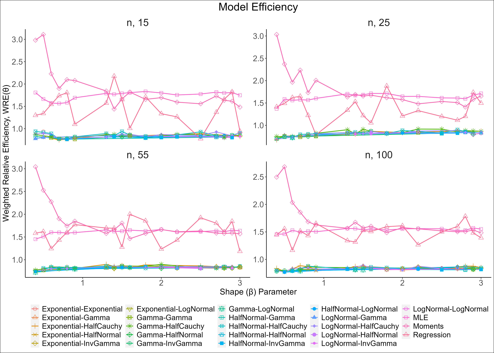
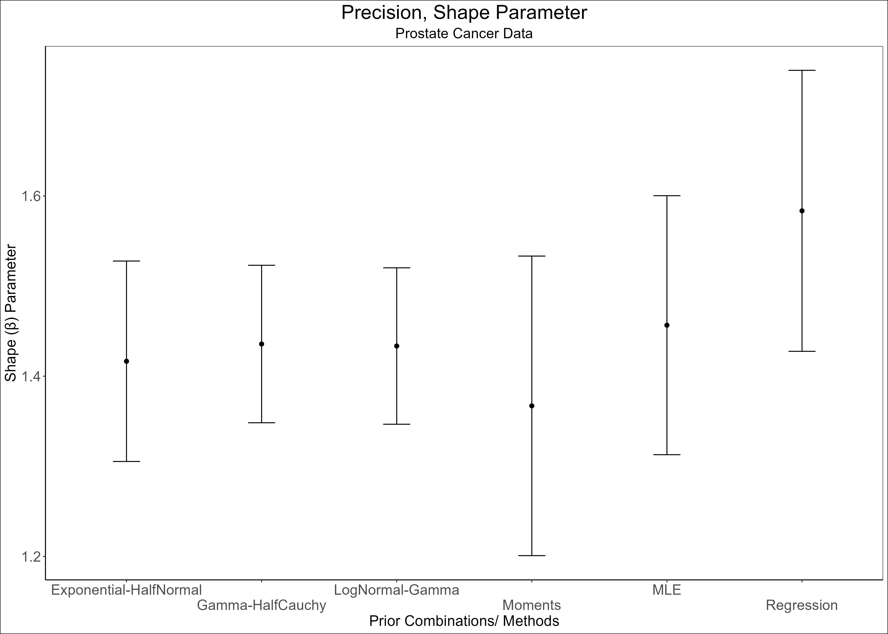
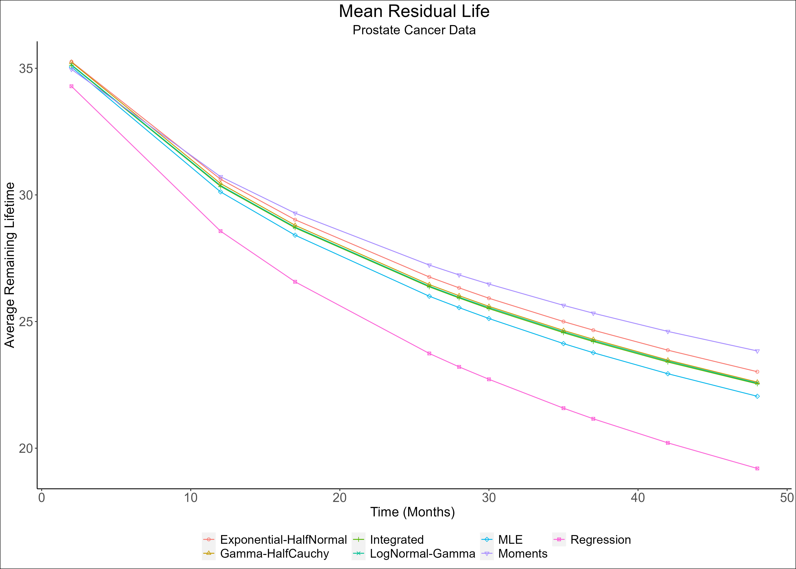

```{r setup, include=FALSE}
knitr::opts_chunk$set((root.dir = getwd()),
                      echo = FALSE,
                      message = FALSE,
                      comment = NA,
                      warning = FALSE, fig.align='center', out.width = "80%",out.height = "50%")
base::rm(list = ls(all.names = TRUE))
if(!require(tinytex)){
  tinytex::install_tinytex()
}
if (!require(pacman))
  install.packages('pacman')

```

```{r LoadPackagesAndData}
base::source(file = "MethodsAndPackages.R")
# Small Sample Size
base::load(file = "misc_PaperBasedOnTheseResults/sim_misc_results/ResultsSimMethods_SmallSmpls")

# Large Sample Size
base::load(file = "misc_PaperBasedOnTheseResults/sim_misc_results/ResultsSimMethods_LargeSmpls")

```

# Trends and distributional properties

```{r}
# Add Plots for Large Sample Sizes & Format Plots and Data for DHR to start from 0.4

ResultsSimMethods <- dplyr::bind_rows(ResultsSimMethods_SmallSmpls, ResultsSimMethods_LargeSmpls) %>%
  dplyr::filter(shape > 0.3) %>% 
  dplyr::arrange(n) 

# Efficiency Trend Plot ---------------------------------------------------

xlab <- paste0("Shape (", expression("\u03B2"),") Parameter")
ylab <- paste0("Weighted Relative Efficiency, WRE(", expression("\u03B8"),")")

# Plot Data, n = 15
PltDt <- ResultsSimMethods %>%
  as_analysis_sim_df(table = FALSE) %>%
  dplyr::mutate(n = factor(paste("n", n, sep = ", "), levels = paste("n", sort(unique(n)), sep = ", ")) )

```


```{r, fig.cap= "The trend of model efficiency for small and large samples of Weibull distributed datasets with monotone hazard rates shows that MCMC methods consistently outperform classical methods"}
# This refers to Fig 2 in the paper

```
\newpage
\clearpage
# Model selections and priorities

```{r}
# Excerpt Tables for Efficiency Trends ------------------------------------

PltDtSectionTab <- PltDt %>%
  select(n, shape, method, prior_comb, rel_wgt_eff) %>%
  mutate(prior_comb = case_when(prior_comb %in% c("Regression", "Moments", "MLE") ~ "-", TRUE ~ prior_comb),
         n = as.character(n), n = readr::parse_number(n), rel_wgt_eff = round(rel_wgt_eff, digits = 3L)) %>%
  separate(col = "prior_comb", into = c("shape_prior", "scale_prior"), fill = "right", sep = "-") %>%
  mutate(across(c("shape_prior", "scale_prior"), \(x) na_if(x, "") %>% replace_na("-")))  %>%
  group_by(shape) %>%
  arrange(desc(rel_wgt_eff), .by_group = TRUE) %>%
  ungroup()  %>% 
  rename(WRE = "rel_wgt_eff")

# Table excerpt (n, 15) for different shape values (0.4, 0.5, 0.6)

PltDtSectionTab %>% 
filter(n==15, shape >= 0.4, shape <= 0.6) %>% 
  draw_table(collapse_cols = 1:3, format = "latex", 
             caption = "A section of results showing weighted relative efficiency for a small
sample size of n = 15 units. The table compares efficiency of different
combinations of prior distributions for the shape and scale parameters of the
Weibull distribution with the classical methods.") %>% 
  add_header_above(c(" " = 3, "Prior Distribution" = 2, "Model Efficiency" = 1))

# Table excerpt (n, 100) for different shape values (1.4, 1.5, 1.6)

PltDtSectionTab %>% 
filter(n==100, shape >1.3, shape < 1.8) %>% 
  draw_table(collapse_cols = 1:3, format = "latex", 
             caption = "A section of results showing weighted relative efficiency for a large
sample size of n = 100. The table highlights that MCMC methods are consistently
more efficient than classical methods.") %>% 
  add_header_above(c(" " = 3, "Prior Distribution" = 2, "Model Efficiency" = 1))


```

```{r}
# Average weighted efficiency tables --------------------------------------

AvgWeightedREff <- ResultsSimMethods %>%
  as_analysis_sim_df(table = TRUE, top.n = 25L) %>%
  tidyr::separate(col = "prior_comb", into = c("shape_prior", "scale_prior"), fill = "right", sep = "-") %>%
  dplyr::mutate(
    method = dplyr::case_when(!(shape_prior %in% c("Moments", "MLE", "Regression")) ~ "MCMC", TRUE ~ shape_prior),
    shape_prior = dplyr::case_when((shape_prior %in% c("Moments", "MLE", "Regression")) ~ "-", TRUE ~ shape_prior),
    scale_prior = case_when(is.na(scale_prior) ~ "-", TRUE ~ scale_prior)
  ) %>%
  dplyr::relocate(method, .after = "hazard") %>% 
  dplyr::rename(AWRE = "mean_rel_wgt_eff")

# Sample Size=15, 25
Avg_Eff_SmallSmpl <-   AvgWeightedREff %>% 
  dplyr::filter(n < 55) 

AvgCapSmallSamples <- "A comparison of the average weighted relative efficiency of the top
MCMC methods with classical methods for small sample sizes. The AWRE is
the average of the weighted relative efficiency (WRE) across lifetime datasets
with either decreasing or increasing hazard rate properties. On average, MCMC
methods are more efficient."

# Small Samples Avg Weighted Relative Efficiency Table
Avg_Eff_SmallSmpl %>% 
   draw_table(collapse_cols = 1:3, font_size = 10, format = "latex", caption =AvgCapSmallSamples ) %>% 
  add_header_above(c(" " = 3, "Prior Distribution" = 2, "Model Efficiency" = 1))

```


```{r}
# Sample Size=55, 100
Avg_Eff_LargeSmpl <-   AvgWeightedREff %>% 
  dplyr::filter(n >= 55) 

AvgCapLargeSamples <- "The average weighted relative efficiency (AWRE) of the top MCMC
methods and the classical methods for large sample sizes. The AWRE is the
average of the weighted relative efficiency (WRE) across lifetime datasets with
either decreasing or increasing hazard rate properties. On average, MCMC
methods are more efficient than the classical methods."

# Large Samples Avg Weighted Relative Efficiency Table
Avg_Eff_LargeSmpl %>%
  draw_table(collapse_cols = 1:3, font_size = 10, format = "latex", caption = AvgCapLargeSamples) %>%
  add_header_above(c(" " = 3, "Prior Distribution" = 2, "Model Efficiency" = 1))


```

\newpage
\clearpage


# Application: Prostate Cancer Survival Data

```{r}
ProstCancer <- c(
  rep(0, 3), 2, 3, 4, 6, rep(7, 2), 8, rep(9, 2), rep(11, 3), rep(12, 3), rep(15, 2),
  rep(16, 3), rep(17, 2), 18, rep(19, 2), 20, 21, rep(22, 2), 23, 24, rep(25, 2), rep(26, 3),
  rep(27, 2), rep(28, 2), rep(29, 2), 30, 31, rep(32, 3), rep(33, 2), 34, 35, 36, rep(37, 2),
  38, 40, rep(41, 2), rep(42, 2), 43, rep(45, 3), 46, rep(47, 2), rep(48, 2), 51, rep(53, 2),
  rep(54, 2), 57, 60, 61, rep(62, 2), 67, 69, 87, rep(97, 2), 100, 145, 158
)

# t = 0, Taken as a Diagnosis Date
ProstCancer <- ProstCancer[ProstCancer > 0]
LifeTime <- list(ProstCancer = ProstCancer)

```


```{r}
# base::load("misc/app_misc_results/RealDtPoolMetrics_PaperBasedOnThisData")

base::load(file = "misc_PaperBasedOnTheseResults/app_misc_results/RealDtPoolMetrics_PaperBasedOnThisData")


# MCMC workflow Prostate Data
# 1. compute weighted_rel_eff (combined methods - MCMC & Classic Methods)
# 2. filter ceil_eff methods (MCMC)
# 3. Rank top methods (MCMC)
# 4. Combine  (MCMC and Classic Output Data)

MetricsProstDt <- weighted_rel_eff(RealDtPoolMetrics) #(combined methods - MCMC & Classic Methods)

# MCMC Methods
MetricsProstDt_mcmc <- MetricsProstDt %>%
  dplyr::filter(method_group=="mcmc") %>%
  # filter out MCMC-Methods with WRE greater than 1 (Non Efficient Methods)
  ceil_eff(eff = "wgt_rel_eff")

# Classic Methods
MetricsProstDt_class <- dplyr::filter(MetricsProstDt, method_group!="mcmc") %>%
  dplyr::arrange(wgt_rel_eff)

MetricsProstDt <- dplyr::bind_rows(MetricsProstDt_mcmc, MetricsProstDt_class) %>%
  # proper_classic_priors()
  methods_to_proper_case(propcol = "method")

Top3Methods <- base::split(MetricsProstDt, ~ method_group) %>%
  purrr::map(\(x)rank_methods(x, rank.by = "wgt_rel_eff", n = 3,descend = TRUE)) %>%
  purrr::reduce(rbind)

Top10Methods <- base::split(MetricsProstDt, ~ method_group) %>% 
  # ranks methods by groups (MCMC and Classics separately)
  purrr::map(\(x)rank_methods(x, rank.by = "wgt_rel_eff", n = 10,descend = TRUE)) %>% 
  purrr::reduce(rbind)

```


```{r}
# Table -Top Ten Methods --------------------------------------------------

ResultingTable <- Top10Methods %>%
  mutate(
    sample_size = length(LifeTime$ProstCancer), 
    method = case_when(!(method %in% c("Moments", "MLE", "Regression")) ~ "MCMC", TRUE ~ method)
  ) %>% 
  dplyr::select(sample_size, method, shapePrior, scalePrior, mean_shape, mean_scale, wgt_rel_eff) %>% 
  purrr::modify_at(c("mean_shape", "mean_scale", "wgt_rel_eff"), round, digits = 3L)

# Top 10 MCMC
CAPTION <- stringr::str_glue(
  "The best combination of prior distributions versus classic methods for accurately estimating the Weibull model’s parameters for the Prostrate cancer data. 
  The actual parameter values are {expression(\u03B2)} = {round(mean(RealDtPoolMetrics$mean_shape),2L)} and {expression(\u03B1)} ={round(mean(RealDtPoolMetrics$mean_scale),2L)}, 
  pooled from the results of the 27 fitted models."
)

ResultingTable %>%
  dplyr::rename(WRE = "wgt_rel_eff") %>% 
  draw_table(collapse_cols = 1:2, format = "latex", caption = CAPTION) %>%
  add_header_above(c(" " = 2, "Priors" = 2, "Estimated Parameters" = 2, "Model Efficiency" = 1))
# add_footnote(str_glue("The true parameter values are {expression(\u03B2)} = {unique(ApplicationPoolMetrics$TruePar_B)}  and {expression(\u03B1)} ={unique(ApplicationPoolMetrics$TruePar_A)},
# # the average of all parameter estimates from the {length(unique(ApplicationPoolMetrics$PriorComb) )} fitted models."))


```


```{r , fig.cap= "Uncertainty for the shape parameter of the Weibull model. We compute the interval as emprical two standard deviations from the actual parameter value obtained using an integrated approach where we pool the results from all methods under the study."}



```


```{r}
# Mean Residual Life (MRL) Plot  ------------------------------------------

# Parameters for MEAN RESIDUAL LIFE, MRL(x)
ParamsMRL <- Top3Methods %>%
  select(method, contains(c("mean"))) %>%
  tibble::add_row(
    method = "Integrated", mean_shape = mean(RealDtPoolMetrics$mean_shape),
    mean_scale = mean(RealDtPoolMetrics$mean_scale)
  )
# A sample of lifetime data
set.seed(TRUE)
SampleLifeTime <- LifeTime %>%
  purrr::map(\(x)sample(x, size = 10L, replace = FALSE) %>% sort())

MRLifeDt <- ParamsMRL %>%
  dplyr::rowwise(mean_shape, mean_scale) %>%
  dplyr::mutate(time = SampleLifeTime, meanResidLife = list(weib_mrl(time, shape = mean_shape, scale = mean_scale))) %>%
  tidyr::unnest_longer(col = c("time", "meanResidLife")) %>%
  dplyr::rename_with(\(x)gsub("mean_", "", x)) %>%
  dplyr::select(method, time, meanResidLife)

```

```{r}
# Sampled Mean Residual Life-Table ------------------------------------------

SampleMRLifeTable <- MRLifeDt %>%
  tidyr::pivot_wider(names_from = method, values_from = meanResidLife, values_fn = list) %>%
  tidyr::unnest(cols = -time) %>%
  dplyr::select(time, Integrated, everything()) %>%
  dplyr::relocate(MLE, .before = "Regression") %>%
  dplyr::relocate(tidyr::contains(c("Gamma", "Exponential") ), .before = "MLE")

nms <- setdiff(names(SampleMRLifeTable), c("time", "Integrated"))

SampleMRLifeTable <- mutate(SampleMRLifeTable, across(tidyselect::all_of(nms), ~ ((.x / Integrated - 1) * 100) %>%
                                                        scales::number(accuracy = 0.01, suffix = "%", style_positive = "plus", big.mark = ",")))

# Table
CaptionLifeTab <- stringr::str_glue(
  "Mean residual lifetime of top three MCMC-based and the classic Weibull model of a randomly sampled prostate cancer survival times.
  The Integrated model uses the actual parameter values {expression(\u03B2)} = {round(mean(RealDtPoolMetrics$mean_shape),2L)} and {expression(\u03B1)} ={round(mean(RealDtPoolMetrics$mean_scale),2L)}, 
  pooled from the results of all the models under the study.
  MCMC and Classic results represent percent deviations from the true mean residual lifetime of the integrated method",
  notation = "number"
)

# Remaining Life of the 10 randomly selected lifetimes
SampleMRLifeTable %>%
  kbl(longtable = FALSE, format = "latex", caption = CaptionLifeTab, align = "c") %>%
  collapse_rows(valign = "top", latex_hline = "none") %>%
  kable_styling(
    latex_options = c("hold_position", "repeat_header"),
    position = "center", font_size = 8, full_width = FALSE
  ) %>%
  add_header_above(c(" " = 2, "MCMC" = 3, "Classics" = 3))

```


```{r MeanResidualLife,echo=FALSE, fig.cap="Mean residual life plot for Prostate cancer data. The MCMC method for calculating the mean residual lifetime is more robust than traditional methods. Regression and MLE methods underestimate the population mean remaining life, while the Moments overestimate the parameter."}

```

\newpage
\clearpage

# Conclussion and Discussion

```{r}
# Small Samples Recommended Prior
RecommendedSmallSamples <- Avg_Eff_SmallSmpl %>% 
  dplyr::filter(method=="MCMC") %>% 
  dplyr::group_by(hazard, method, shape_prior, scale_prior) %>% 
  dplyr::mutate(AWRE= mean(AWRE), .keep = "unused") %>% 
  dplyr::ungroup() %>% 
  dplyr::select(-c(n, method) ) %>% 
  base::unique() %>% 
  dplyr::arrange(hazard, desc(AWRE)) %>% 
  dplyr::mutate(n = "n = (15, 25)", .before = "hazard")


# Large Samples Recommended Prior
RecommendedLargeSamples <- Avg_Eff_LargeSmpl %>% 
  dplyr::filter(method=="MCMC") %>% 
  dplyr::group_by(hazard, method, shape_prior, scale_prior) %>% 
  dplyr::mutate(AWRE= mean(AWRE), .keep = "unused") %>% 
  dplyr::ungroup() %>% 
  dplyr::select(-c(n, method)) %>% 
  base::unique() %>% 
  dplyr::arrange(hazard, desc(AWRE)) %>% 
  dplyr::mutate(n = "n = (55, 100)", .before = "hazard")

RecommendedMethods <- dplyr::bind_rows(RecommendedSmallSamples, RecommendedLargeSamples)

RecommendedMethods %>% 
  dplyr::filter(hazard=="DHR") %>% 
  draw_table(collapse_cols = c(1:2, 4), format = "latex", caption = "A list of recommended combinations of prior distributions for small and large
Weibull-distributed data sets with decreasing hazard rate properties. The priors are ranked based
on the AWRE.")

```

```{r}
RecommendedMethods %>% 
  dplyr::filter(hazard=="IHR") %>% 
  draw_table(collapse_cols = c(1:2, 4), format = "latex", caption = "A list of recommended combinations of prior distributions for small and large
Weibull-distributed data sets with increasing hazard rate properties. The priors are ranked based on
the AWRE.")

```


